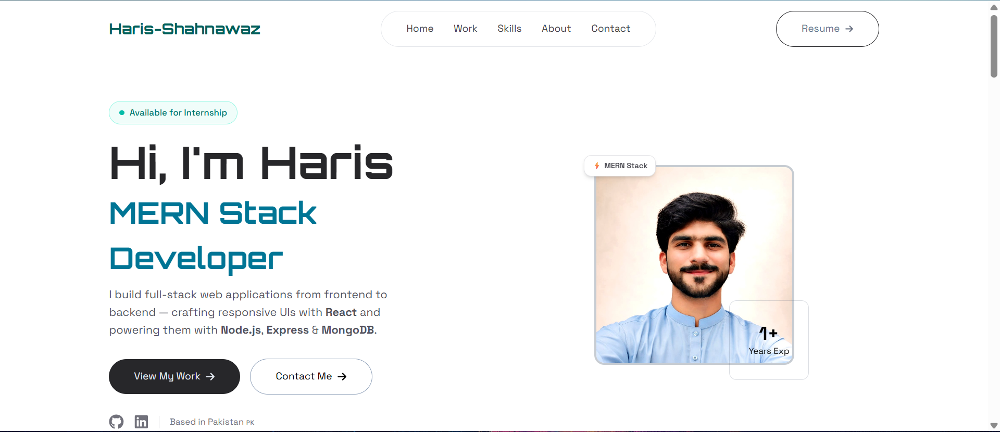

# Haris Shahnawaz - Portfolio Website

A modern, responsive portfolio website built with React.js and Tailwind CSS, showcasing my projects, skills, and experience as a Frontend Web Developer.

## 🌐 Live Demo
[View Live](https://my-portfolio-website-eight-ashy.vercel.app/)

## 📸 Preview


## 🛠️ Built With
- **React.js** - Frontend framework
- **Tailwind CSS v4** - Styling
- **Vite** - Build tool
- **Framer Motion** - Animations
- **React Icons** - Icon library
- **React Router DOM** - Routing

## ✨ Features
- Fully responsive design (mobile, tablet, desktop)
- Smooth scroll navigation
- Animated sections with Framer Motion
- Projects showcase with live demo links
- Skills section with tech stack
- About section with downloadable resume
- Contact form
- Social media links

## 📂 Project Structure
```
src/
├── assets/
│   ├── asstes.js       # Data and assets
│   └── profile.png     # Profile image
├── components/
│   ├── Navbar.jsx
│   ├── Hero.jsx
│   ├── Work.jsx
│   ├── Skills.jsx
│   ├── About.jsx
│   ├── Contact.jsx
│   └── Footer.jsx
└── pages/
    └── Home.jsx
```

## 🚀 Getting Started

### Prerequisites
- Node.js
- npm

### Installation
1. Clone the repository
```bash
git clone https://github.com/HarisShahnawaz/My-Portfolio-Website.git
```

2. Navigate to project directory
```bash
cd My-Portfolio-Website
```

3. Install dependencies
```bash
npm install
```

4. Run development server
```bash
npm run dev
```

5. Open browser and visit
```
http://localhost:5173
```

## 📬 Contact
- **Email:** harishahnawaz97@gmail.com
- **LinkedIn:** [Haris Shahnawaz](https://www.linkedin.com/in/haris-shahnawaz-670aa8291/)
- **GitHub:** [HarisShahnawaz](https://github.com/HarisShahnawaz)
- **Instagram:** [shahnawaz.haris](https://www.instagram.com/shahnawaz.haris/)

## 📄 License
This project is open source and available under the [MIT License](LICENSE).

---
⭐ If you like this project, please give it a star on GitHub!
